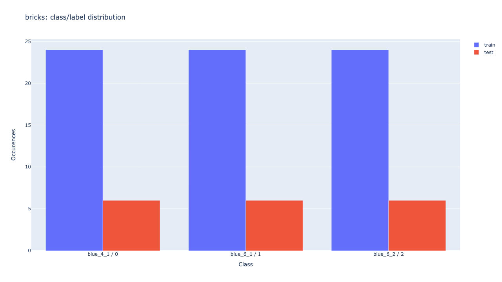
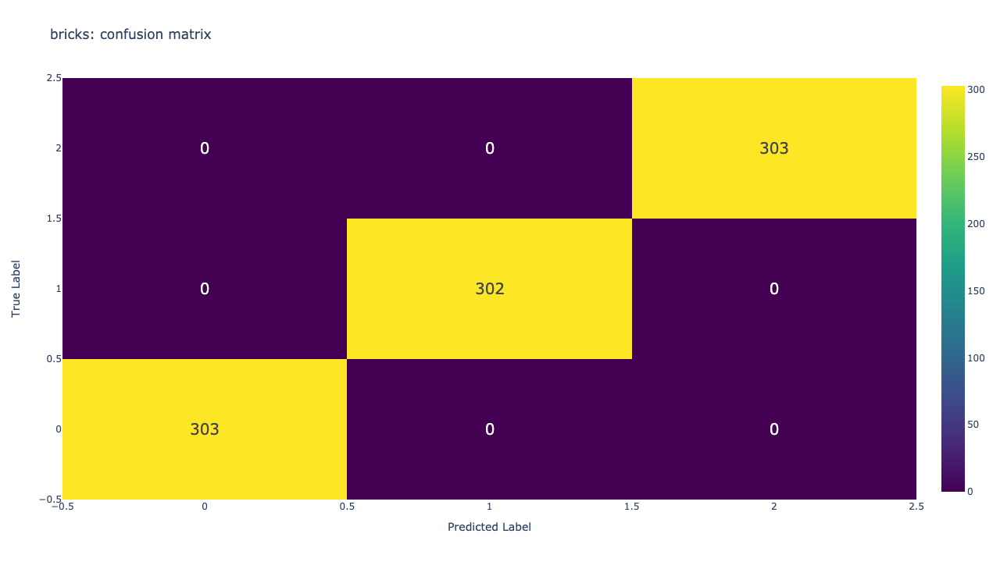
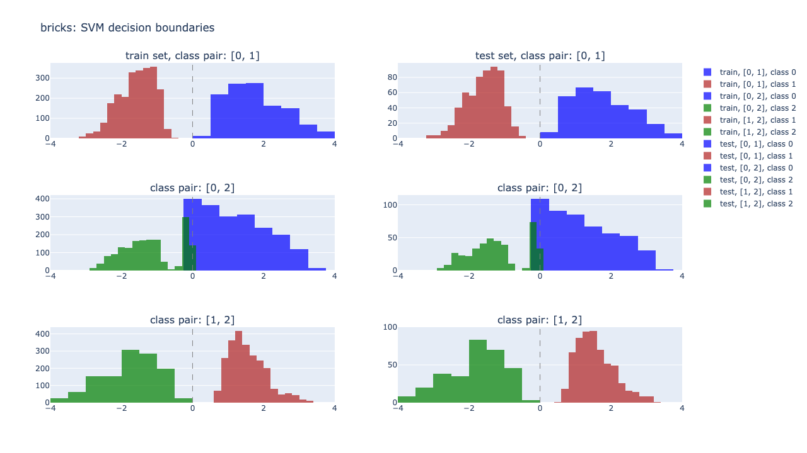
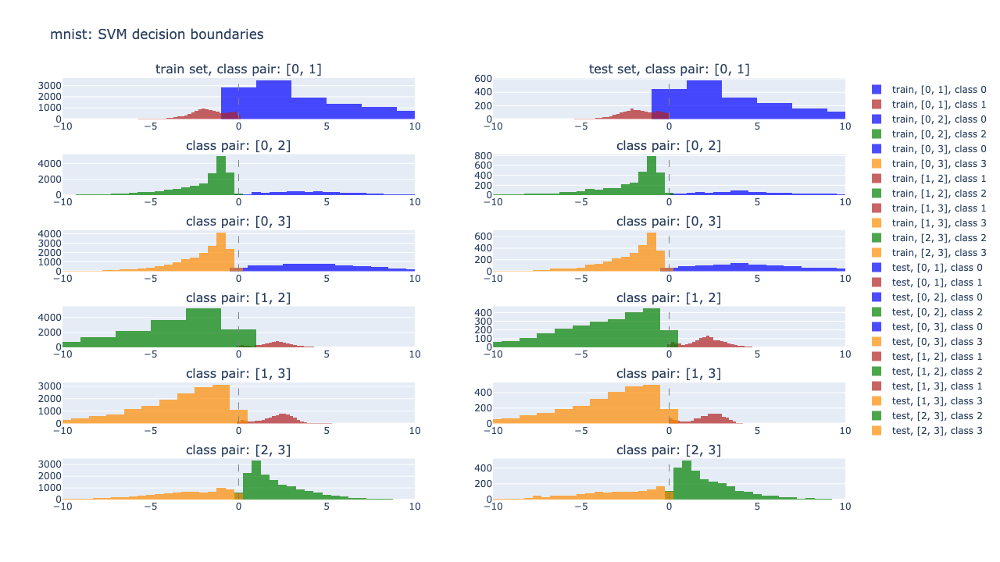

# 🧱 bricks

  
  
  

Classification of playing bricks.

## Why?
Solving a real life classification problem, in building a solution for classifying playing bricks. Additionaly this repo and project serves as the author's personal learning space. 
For now a solution based on a support vector machine (SVM) is provided here.

## Getting started
* (pip3 install --upgrade pip)
* (pip3 install virtualenv)
* virtualenv -p python3 _venv
* source _venv/bin/activate
* on macos: pip3 install -r requirements_macos.txt
* on Linux/RaspiOS: pip3 install -r requirements_linux.txt
* (deactivate)

## Support Vector Machine (SVM) - multiclass decision distribution

### SVM
A [SVM](https://scikit-learn.org/stable/modules/generated/sklearn.svm.SVC.html) was choosen for now because the data set is not very large, and I assume that there is a clear margin of separation between classes. This qualifies a SVM as good tool for this classification task.
If you want to get an idea of what a SVM is, a basic and visual explanation of SVM can be found under [Support Vector Machines: A Simple Explanation](https://www.kdnuggets.com/2016/07/support-vector-machines-simple-explanation.html).

### Dataset & augmentation
The origin of my data set consists of three playing brick images (1 x 4-by-1, 1 x 6-by-1, 1 x 6-by-2); all with the same color. Each of those images and shapes of the bricks represent a class which is subject to be classified.
 

    
    
    

In a first step I applied augmentation methods like rotation, flipping, or adaption of brightness and contrast with different settings individually to the original images. This results in a rather limited data set with 30 (24 train, 6 test) samples per class, as shown here.
 

Applying augmentation methods not in an individual but in a combined way, results very quickly in a wealth of over 4000 augmented images. An equal distribution of train and test data is shown in the image below. This will be my data set for now.
 

### Evaluation - bricks
Training and testing a [SVM](https://scikit-learn.org/stable/modules/generated/sklearn.svm.SVC.html) on the generated and augmented image data set, produces the following confusion matrix. Looks pretty neat with an accuracy of 100%.
 

Now, an accuracy metric and a confusion matrix gives good indication about the model performance. However we can dig a step further and see how narrow or close the decisions of the test set applied to the trained model are. For this I used the method [sklearn.svm.SVC.decision_function](https://scikit-learn.org/stable/modules/generated/sklearn.svm.SVC.html#sklearn.svm.SVC.decision_function), which returns (signed) distances to each of the separating hyperplanes. There's one hyperplane for each pair of classes.
 
The following plots show histograms of the SVM decision distances. Left column is for the train set, right column for the test set. One row shows the histogram of distances for one pair of classes (i.e. [0,1], [0,2] or [1,2]).
Looking only at the right/test column in the diagram, e.g. the upper right plot shows that the SVM is trained in a way, that it can clearly separate 'class 0' and 'class 1'. The histogram of the decision boundaries/distances for 'class 0' live on one side of the x-axis, and for 'class 1' on the other side.
 

That's it? Almost 😉. Those multiclass decision histograms give us even more info. Comparing the left/train and the right/test column (per row) shows us that the train set has a very similar distribution of decision function outputs as the test set. Therefore we might say that the model has good performance on generalisation.

### Evaluation - MNIST
One more thing. In order to verify if the multiclass decision histograms are implemented correctly, I applied the well known MNIST data set to it. The used hand written digit data set is limited to numbers 0, 1, 2, 3 to keep processing time and plotting space in reasonable ranges.
From the plot below we can see that histograms of the decision boundaries for the provided MNIST train and test data work in the same fashion as described above for the bricks data set. Great, this means the histograms work good on a known public data set as well as on the bricks data set, and thus are a good tool explaining the properties of SVM decision distances.
 

## References
* [Support Vector Machines: A Simple Explanation](https://www.kdnuggets.com/2016/07/support-vector-machines-simple-explanation.html)
* [A Practical Guide to Interpreting and Visualising Support Vector Machines](https://towardsdatascience.com/a-practical-guide-to-interpreting-and-visualising-support-vector-machines-97d2a5b0564e)
* [MNIST data set](https://en.wikipedia.org/wiki/MNIST_database)
